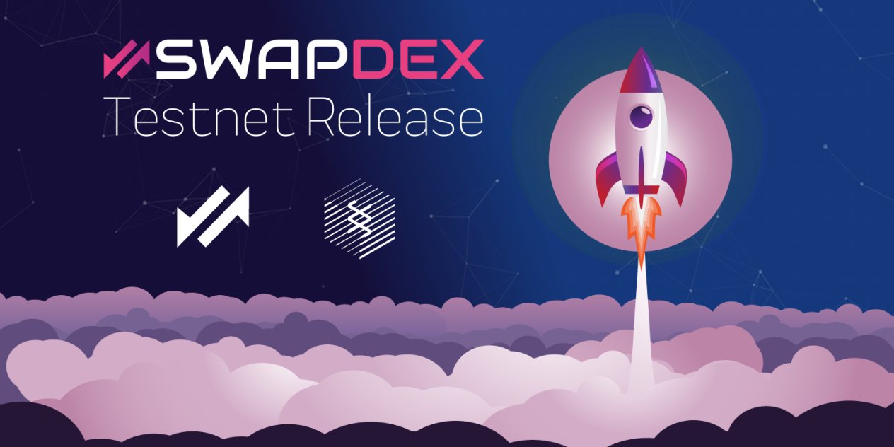

# SwapDex

!!! Warning
    Work in progress content can change and it's not definitive. 

## Disclaimer:

**Blockchain technologies are constantly evolving. This paper describes the best possible planned development, however due to the nature of the technology and the complexity of integrating the world of blockchain.**

**This document may be subject to change. We try to come as close as possible to the original plan, but sometimes modifications are necessary to improve the user experience and overcome technological barriers encountered during development.**

## References

* [https://substrate.dev/docs/en/knowledgebase/smart-contracts/](https://substrate.dev/docs/en/knowledgebase/smart-contracts/)
* [https://substrate.dev/docs/](https://substrate.dev/docs)

   