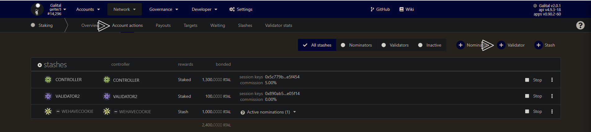

# Setup Masternode

## Requirements

The most common way for a beginner to run a validator is on a cloud server running Linux. You may choose whatever [VPS providers](#list-of-vps-providers) that your prefer, and whatever operating system you are comfortable with.

The transactions weights in Galital Testnet were benchmarked on standard hardware. It is recommended that validators run at least the standard hardware in order to ensure they are able to process all blocks in time. The following are not minimum requirements but if you decide to run with less than this beware that you might have performance issue.

### Minimum Hardware :

- 6GB ram, 60 GB Storage, 2 CPU , <strong>stable server uplink connection with fixed IP</strong>

### Ideal Hardware :

- 60GB ram, 300 GB Storage, 6 CPU, <strong>stable server uplink connection with fixed IP</strong>


## Using Ubuntu 20.04 : 

### Update your Ubuntu
```
sudo apt-get update
```

### Validator

Install & Configure Network Time Protocol (NTP) Client
NTP is a networking protocol designed to synchronize the clocks of computers over a network. NTP allows you to synchronize the clocks of all the systems within the network. Currently it is required that validators' local clocks stay reasonably in sync, so you should be running NTP or a similar service. You can check whether you have the NTP client by running:

If you are using Ubuntu 18.04 / 19.04 / 20.04, NTP Client should be installed by default.
```
timedatectl
```
If NTP is installed and running, you should see System clock synchronized: yes (or a similar message). If you do not see it, you can install it by executing:
```
sudo apt-get install ntp
```
ntpd will be started automatically after install. You can query ntpd for status information to verify that everything is working:
```
sudo ntpq -p
```

>WARNING: Skipping this can result in the validator node missing block authorship opportunities. If the clock is out of sync (even by a small amount), the blocks the validator produces may not get accepted by the network. This will result in ImOnline heartbeats making it on chain, but zero allocated blocks making it on chain. 
>


## Installing the Galital Testnet Binary

<br>

Install and configure time
```
sudo apt install chrony
```

Enable it
```
sudo systemctl enable chrony
```

Allow the process in firewall

```
sudo apt install firewalld
```
```
sudo firewall-cmd --permanent --add-service=ntp && sudo firewall-cmd --add-port=30333/tcp --permanent && sudo firewall-cmd --reload
```

get Galital package from github

```
wget https://github.com/starkleytech/galital/releases/download/2.0.0/galital && sudo chmod +x ./galital && sudo mv ./galital /usr/bin/galital
```

## Make the service permanent

create systemd file in /etc/systemd/system/tal.service

```
sudo nano /etc/systemd/system/tal.service
```

```
[Unit]
Description=Galital Validator
After=network-online.target

[Service]

ExecStart=/usr/bin/galital --port "30333" --name "A Node Name" --validator  --telemetry-url 'wss://substrate-telemetry.starkleytech.com/submit/ 0' --chain galital   
User=root
Restart=always
ExecStartPre=/bin/sleep 5
RestartSec=30s

[Install]
WantedBy=multi-user.target
```

> If you need to change port, you can setup with `--prometheus-port` `--rpc-port` and `--ws-port`

then start the service
```
sudo systemctl enable tal && sudo service tal start 
```

Check if your node is appearing in the telemetry UI : [https://telemetry.polkadot.io/#list/Galital](https://telemetry.polkadot.io/#list/Galital)

> Do not forget to change the name parameter (--name "A Node Name")


## Step 2 Assign the node to an account

You can get some RTAL (Testnet token) with the discord bot

You need to create an controller account in order to do the next steps. 

>The stash account serve as you "cold wallet" with all your precious coin
>
>The controller account serve as a manager to your stash account
><br></br><strong>Always keep in safe place your keystore file or your 12/24 words seed</strong>

To create an controller account, add account


Save your mnemonic seed

 
then name your account and add a password
 

Then send some pirl (from your stash account) for covering network fees

You can proceed to the next steps

### Create session key:

Go in you terminal where the node is installed and paste the current command, you will have a session key of your node.

```
curl -H "Content-Type: application/json" -d '{"id":1, "jsonrpc":"2.0", "method": "author_rotateKeys", "params":[]}' http://localhost:9933
```

### Submitting the setKeys Transaction:

Go to the [testnet](https://polkadot.js.org/apps/?rpc=wss%3A%2F%2Ftestnet-rpc.pirl.network#/staking/actions) you can now create a validator, use the key generated above to paste in the form.


Select your stash account, controller account and so one


Add you keys form the past command.


You should now see your validator in the waiting tab


Voila, you are all set

<br></br>

<p align=right> Written by Masterdubs & WeHaveCookie </p>