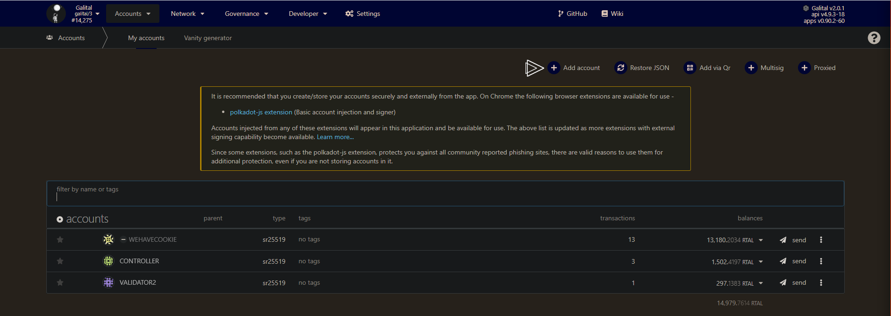
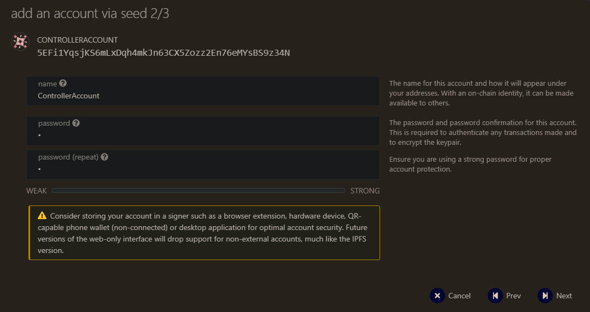
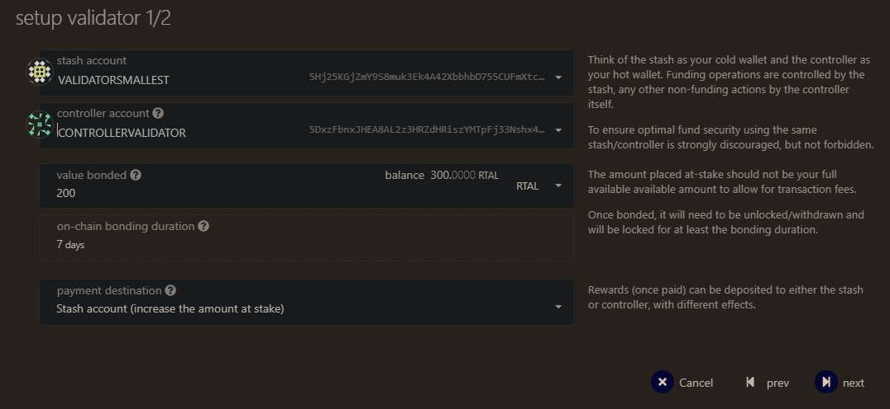
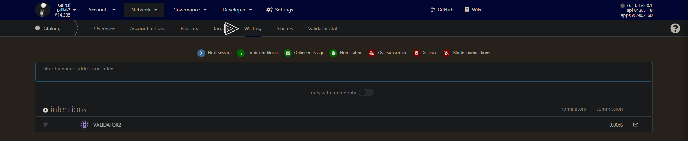

# Become a Validator

The following guide will teach you how to set up a Smart Dex Chain Validator. The process of becoming a validator requires two steps. The first step is to set up a network node. The second step is to assign your node to your account and apply for validator candidacy.

Network validators are the foundation of a decentralized proof-of-stake network because they are responsible for concluding on a consensus by creating new and validating already produced blocks. That said, network validators are the prime target for adversaries that aim to sabotage the network. The Smart Dex Chain has many layers to protect the network from attacks. The first layer is the security of each validator itself. Another layer is the slashing mechanism that detects validator nodes that display abnormal or dangerous behavior and punishes them with slashes. A slash will, in all cases, lead to the loss of funds. 

!!! warning
    Hence the warning: Running a validator on a live network is a lot of responsibility! You will be accountable for your stake and the stake of your current nominators. If you make a mistake and get slashed, your money and your reputation will be at risk. However, running a validator can also be very rewarding, knowing that you contribute to the security of a decentralized network while growing your stash.

## Setp 1 - Setup a Network Node

## Requirements

You can operate a network node on a local computer, a professional server-rig in your basement, or on a remotely hosted virtual private server (VPS) in the clouds. It's up to you to choose the infrastructure you feel most comfortable with. What doesn't change are the requirements of a network node that operates as a validator. Validators should always be online and powerful enough to create and validate the authoring process of new blocks. If your validator is failing at one of these requirements, it will get punished by slashes.

!!! tip
    The most common way for a beginner to run a validator is on a VPS running Linux. You may choose whatever VPS providers that you prefer. 

We benchmarked the transactions weights on the Smart Dex Chain Testnet on standard hardware. We recommend that validators run at least the standard hardware to ensure they can process all blocks in time. The following are not minimum requirements, but if you decide to run with less than this, beware that you might have a performance issue.

### Lower-end Hardware :

- 6GB ram, 60 GB Storage, 2 CPU , <strong>stable server uplink connection with fixed IP</strong>

### Ideal Hardware :

- 60GB ram, 300 GB Storage, 6 CPU, <strong>stable server uplink connection with fixed IP</strong>

!!! info
    Anything between the lower-end and ideal hardware should be sufficient to run a validator on the Smart Dex Chain testnet. 


## Using Ubuntu 20.04 : 

### Update your Ubuntu
```
sudo apt-get update
```

### Validator

Install & Configure Network Time Protocol (NTP) Client
NTP is a networking protocol designed to synchronize the clocks of computers over a network. NTP allows you to synchronize the clocks of all the systems within the network. Currently it is required that validators' local clocks stay reasonably in sync, so you should be running NTP or a similar service. You can check whether you have the NTP client by running:

If you are using Ubuntu 18.04 / 19.04 / 20.04, NTP Client should be installed by default.
```
timedatectl
```
If NTP is installed and running, you should see System clock synchronized: yes (or a similar message). If you do not see it, you can install it by executing:
```
sudo apt-get install ntp
```
ntpd will be started automatically after install. You can query ntpd for status information to verify that everything is working:
```
sudo ntpq -p
```

>WARNING: Skipping this can result in the validator node missing block authorship opportunities. If the clock is out of sync (even by a small amount), the blocks the validator produces may not get accepted by the network. This will result in ImOnline heartbeats making it on chain, but zero allocated blocks making it on chain. 
>


## Installing the swapdex Testnet Binary

<br>

### Install and enable Chrony
Chrony is time synchronization service. It will keep time on server in sync, which is crucial for validator to operate without interruption.
```
sudo apt install chrony
sudo systemctl enable chrony
```

### Firewall configuration
Configure firewall ports to allow SSH and Validator service to communicate.
```
sudo ufw allow 22
sudo ufw allow 30333
sudo ufw enable
```

### Setup fail2ban
It provides basic-level protection against distributed brute-force attacks.
```
sudo apt install -y fail2ban && sudo systemctl enable fail2ban && sudo service fail2ban start
```

### Install swapdex Validator binaries
```
wget https://github.com/starkleytech/swapdex/releases/download/2.0.1/swapdex && sudo chmod +x ./swapdex && sudo mv ./swapdex /usr/bin/swapdex
```

### Create user account to run Validator
It is recommended to run validator as non-root user.
For that create dedicated user account which will be used to run validator.
```
sudo adduser swapdex
```
when adding user you will be asked to provide password and some additional details for the account.
Only password is mandatory, other parameters can be left blank.

### Create swapdex Validator service
Create service file file in /lib/systemd/system/tal.service
```
sudo nano /lib/systemd/system/swapdex.service
```

Content of swapdex.service file ***(make sure to change "A Node Name" and replace it with your moniker)***:
```
[Unit]
Description=swapdex Validator
After=network-online.target

[Service]
ExecStart=/usr/bin/swapdex --port "30333" --name "A Node Name" --validator --chain swapdex   
User=swapdex
Restart=always
ExecStartPre=/bin/sleep 5
RestartSec=30s
LimitNOFILE=8192

[Install]
WantedBy=multi-user.target
```

> If you need to change port, you can setup with `--prometheus-port` `--rpc-port` and `--ws-port`

then start the service
```
sudo systemctl enable swapdex && sudo service swapdex start 
```

### Check if validator is started
To ensure that swapdex Validator process works:
```
ps aux | grep swapdex
```

You should see similar output:
```
swapdex   8108  9.9 21.0 1117976 419772 ?      Ssl  May17 601:17 /usr/bin/swapdex --port 30333 --name "A Node Name" --validator --chain swapdex
```

Check if your node is appearing in the telemetry UI : [https://telemetry.polkadot.io/#list/swapdex](https://telemetry.polkadot.io/#list/swapdex)

> Do not forget to change the name parameter (--name "A Node Name")


## Part 2 - Assign the node to an account

You can get some RTAL (Testnet token) with the discord bot

You need to create an controller account in order to do the next steps. 

>The stash account serve as you "cold wallet" with all your precious coin
>
>The controller account serve as a manager to your stash account
><br></br><strong>Always keep in safe place your keystore file or your 12/24 words seed</strong>

To create an controller account, add account


Save your mnemonic seed

 
then name your account and add a password
 

Then send some $RTAL (from your stash account) for covering network fees

You can proceed to the next steps

### Create session key:

Go in you terminal where the node is installed and paste the current command, you will have a session key of your node.

```
curl -H "Content-Type: application/json" -d '{"id":1, "jsonrpc":"2.0", "method": "author_rotateKeys", "params":[]}' http://localhost:9933
```

### Submitting the setKeys Transaction:

Go to the [testnet](https://polkadot.js.org/apps/?rpc=wss%3A%2F%2Fswapdex-rpc-testnet.starkleytech.com#/staking/actions) you can now create a validator, use the key generated above to paste in the form.


Select your stash account, controller account and so one


Add you keys form the past command.


You should now see your validator in the waiting tab



Voila, you are all set

<br></br>

<p align=right> Written by Masterdubs & WeHaveCookie </p>
